# Documentation on Web-Stack-Implementation-LEMP-STACK-101-107
LEMP refers to a collection of open-source software that is commonly used together to serve web applications. The term LEMP is an acronym that represents the configuration of a Linux operating system with an nginx (pronounced engine-x, hence the E in the acronym) web server, with site data stored in a MySQL database and dynamic content processed by PHP.

## LEMP-Stack-101 : EC2 instace and Virtual Ubuntu Server
AWS acoount was already created in LAMP stack project. I have created another EC2 instance for LEMP Stack Implentation.

### Created New EC2 instance and Setting up Ubuntu 
- First, created an ec2 instance named it as "Second-instance-aws" in a region "Ohio" with instance type "t2.micro", AMI (Amazon Machine Image ) as "ubuntu", previously created security group having inbound rules for (SSH,HTTP,HTTPS) and all other required configuration was selected as default here.
 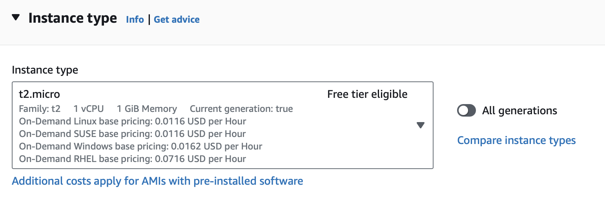
 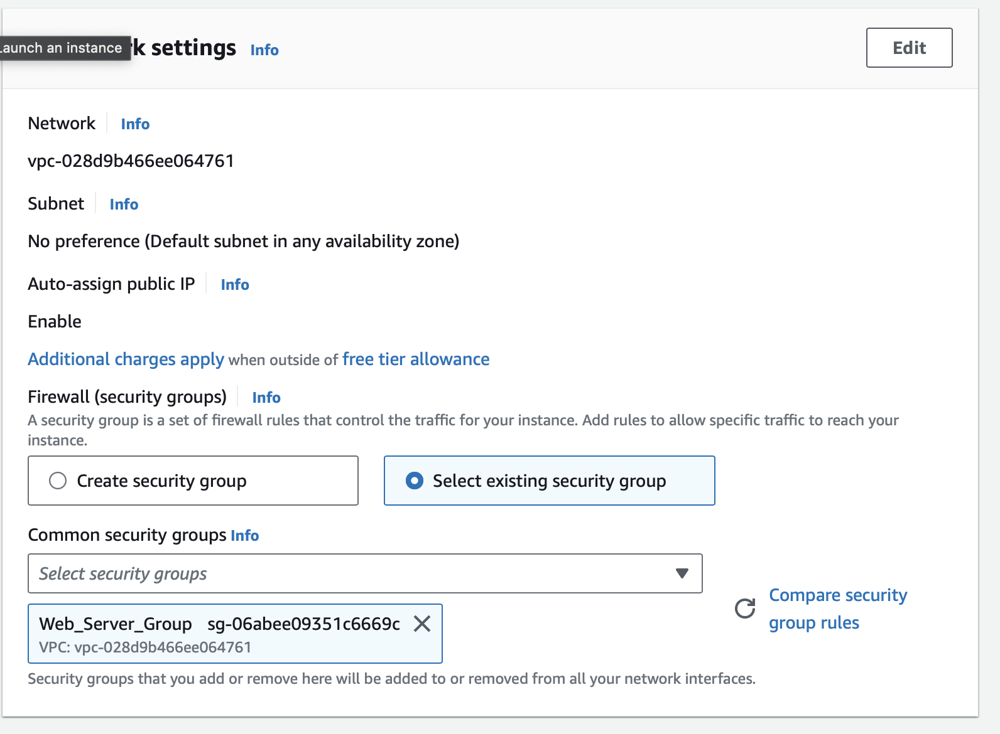
 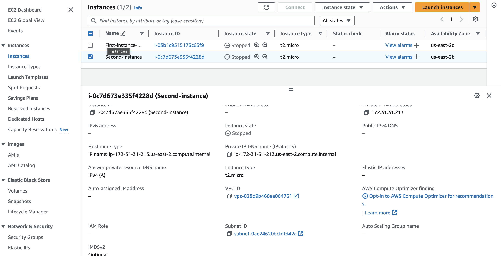
- Latest version of ubuntu was selected which is "Ubuntu Server 22.04 LTS (HVM)". An AMI is a template that contains the software configuration (operating system, application server, and applications) required to launch your instance.
 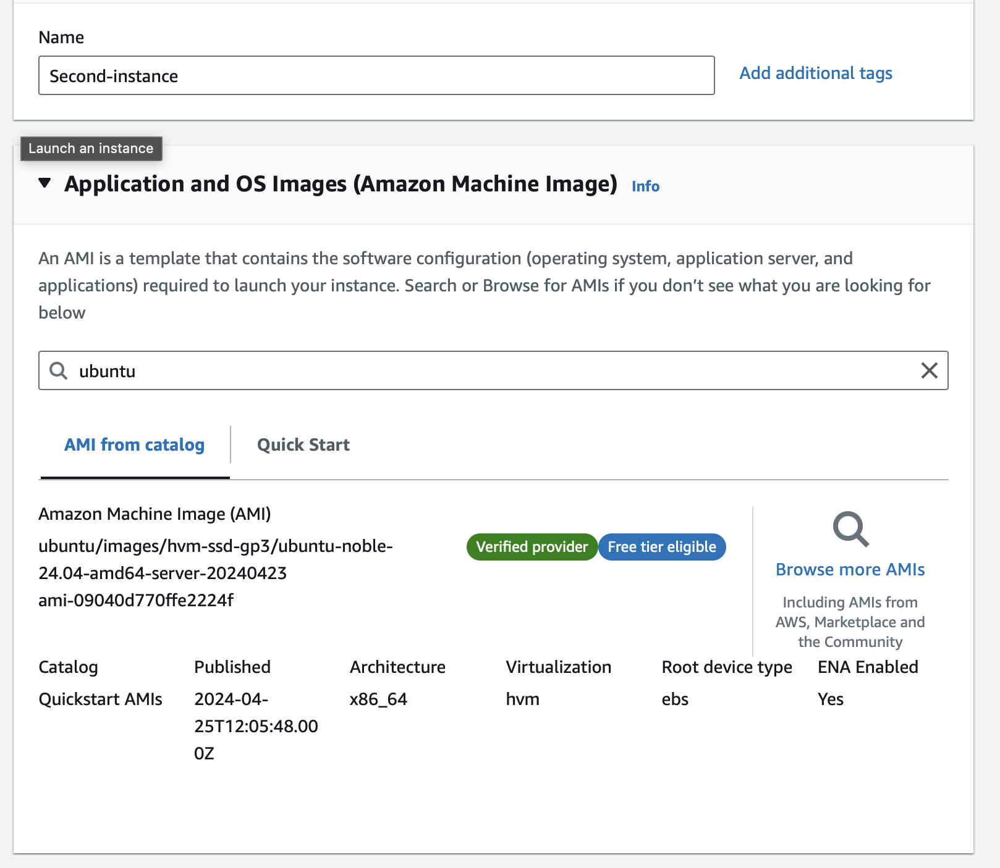
- Private key was generated and named it as : "Second-private-key" and downloaded ".pem" file.

### Connecting virtual server to EC2 instance
Used the same private key previously downloaded to connect to EC2 instace via ssh :
- Created security group configuration adding ssh and updated this configuration to my ec2 instance to access  TCp port 22.
- Changed the permission for "Second-private-key.pem" file as :

  ```
  chmod 400 "Second-private-key.pem"
  ```
- Connected to the instance as
  ```
  ssh -i "Second-private-key.pem" ubuntu@ec2-18-118-196-158.us-east-2.compute.amazonaws.com
  ```
  This get changes as you stopped the ec2 instance and run again.
  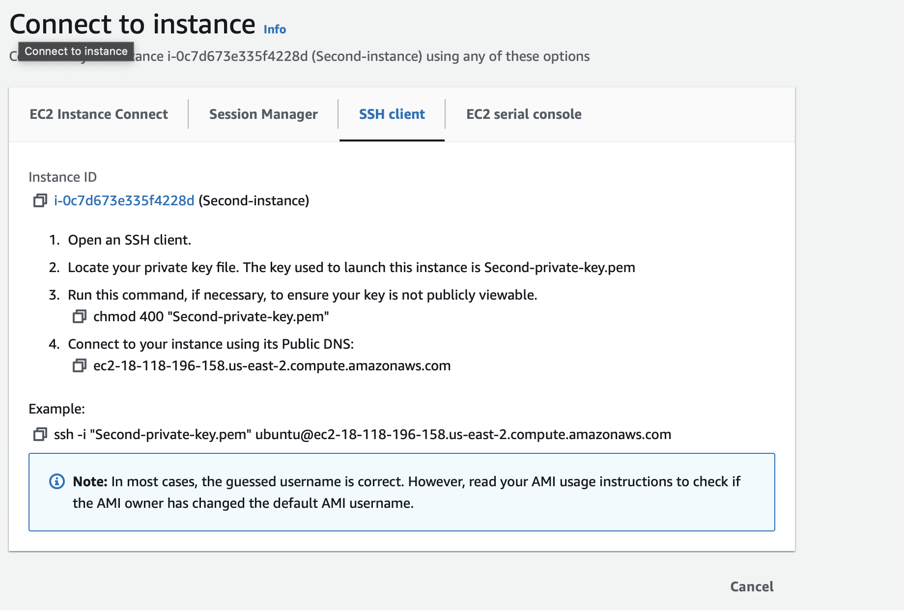

### Conclusion 
Linux Server in the cloud was created.

## LEMP-Stack-102 : Installing the Nginx Web Server
- Nginx (pronounced "engine-x") is an open source reverse proxy server for HTTP, HTTPS, SMTP, POP3, and IMAP protocols, as well as a load balancer, HTTP cache, and a web server (origin server). 
- Nginx was installed using Ubuntu's pacakge manager 'apt' :
  ```
  sudo apt update
  sudo apt install nginx
  ```
  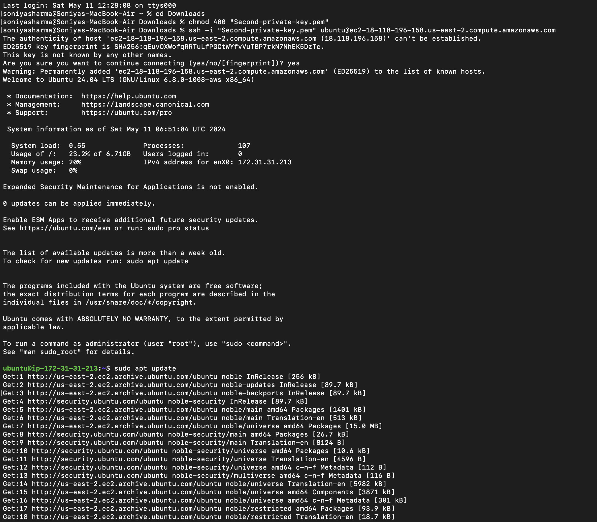
  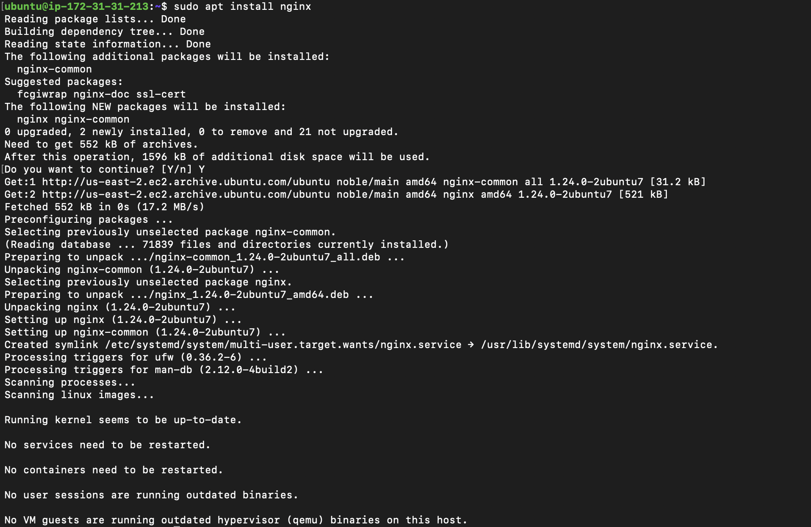

- Verified that nginx is running as a service in ubuntu as :
  ```
  sudo systemctl status nginx
  ```
  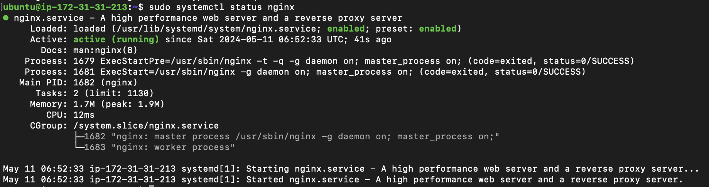

### Conclusion 
First WebServer had been launched.

- To recieve any traffic by my webserver, I need to open TCP port 80. Added TCP port 80 in security group inbound rules of my ec2 instance.
Note: TCP port 80 is the default port that web browsers use to access web pages on the internet.

#### We can access Webserver locally and from the internet.
- Checked how I can access it locally, by :
  ```
  curl http://localhost:80
  curl http://127.0.0.1:80
  ```
  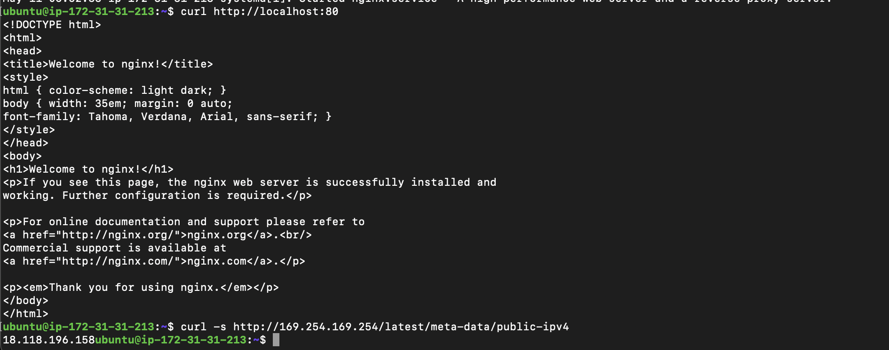

- Finally get access to Nginx Default Page in our web browser that previously got by curl command with nice html formatting by web browser.

  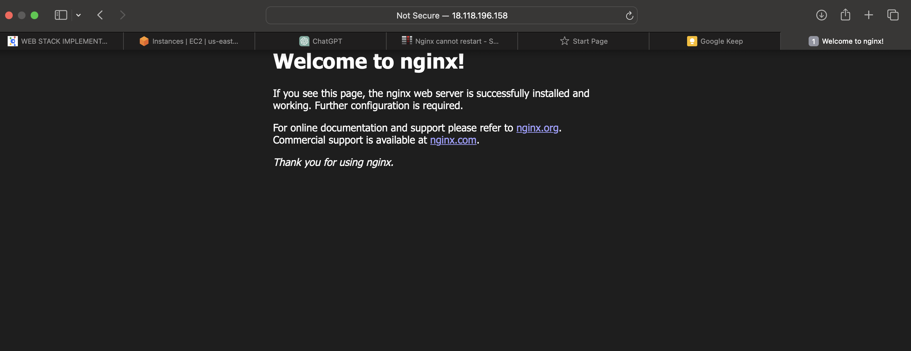

## LEMP-Stack-103 : Installing MySQL
MySql is a popular relational database management system used within PHP environements.
- Installed MySql by using :
  ```
  sudo apt install mysql-server
  ```
  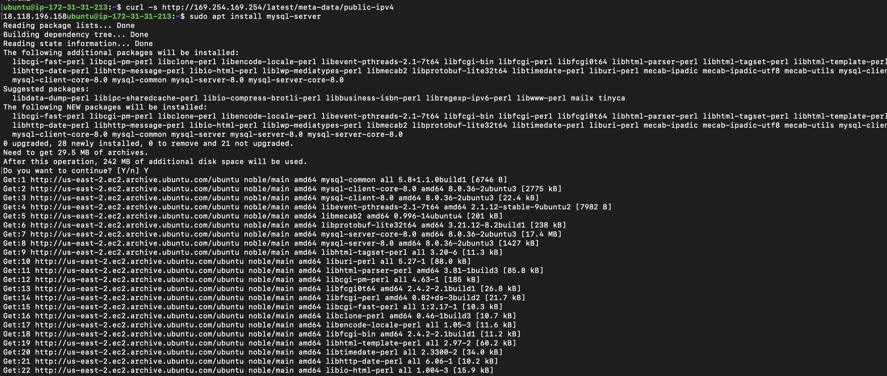
  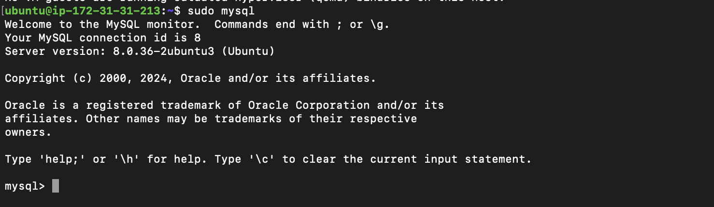

- Set the MySql password :
  ```
   ALTERUSER 'root'@'localhost' IDENTIFIED WITH mysql_native_password BY 'place the password here';
  ```

  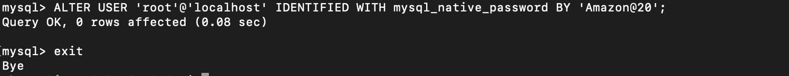

- Did mysql secure installation :
  ```
  sudo mysql_secure_installation
  ```
  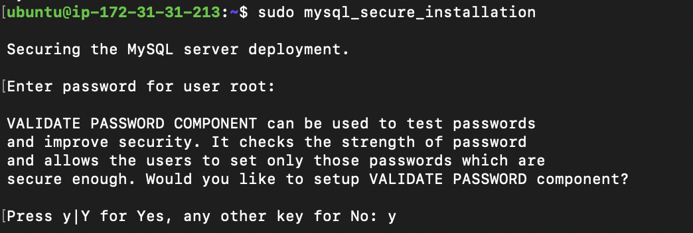
  

- Then, Logged into mysql server running :
  ```
  sudo mysql -p
  ```
  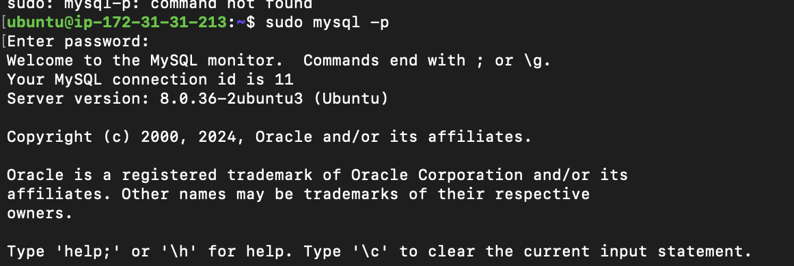  
- Exited from MySql:
  ```
  exit
  ```

### Conclusion
Using all these command, MySQl server was installed and secured.

## LEMP-Stack-104 : Installing PHP
- Nginx requires an external program to handle PHP processing and act as a bridge between the PHP interpreter itself and the web server. 
- Needed to install php-fpm, which stands for "PHP fastCGI process manager", and tell Nginx to pass PHP requests to this software for processing. Additionally, needed php-mysql, a PHP module that allows PHP to communicate with MySQL-based databases.
- Installed PHP using command :
  ```
  sudo apt install php-fpm php-mysql
  ```
- Confirming PHP version :
  ```
  php -v
  ```
  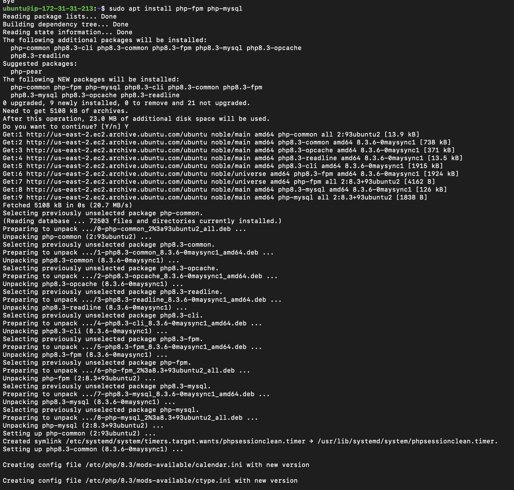

## LEMP-Stack-105 : Configuring Nginx to Use PHP Processor
- Project "projectLEMP"
- Used projectLEMP as an example domain name.
- Created the root web directory for example domain :
    ```
    sudo mkdir /var/www/projectLEMP
    ```
  - Assigned ownership of the directory with $USER environment variable :
    ```
    sudo chown -R $USER:USER /var/www/projectLEMP
    ```
  - Created and open a new configuration file in Nginx's sites-available directory using nano :
    ```
    sudo nano /etc/nginx/sites-available/projectLEMP
    ```
  - nano was be opened , no need to go to insert mode as in Vim, started writing :
  ```
    server {
    listen 80;
    server_name projectLEMP www.projectLEMP;
    root /var/www/projectLEMP;
    index index.html index.htm index.php;

    location / {
        try_files $uri $uri/ =404;
    }

    location ~ \.php$ {
        include snippets/fastcgi-php.conf;
        fastcgi_pass unix:/var/run/php/php8.3-fpm.sock;
        fastcgi_param SCRIPT_FILENAME $document_root$fastcgi_script_name;
        include fastcgi_params;
    }

    location ~ /\.ht {
        deny all;
    }
    }
    ```

  - saved and exit (CTRL+X, and then y and ENTER to confirm).

  - Activated configuration by linking to the config file from Nginx's sites-enabled directory :
    ```
    sudo ln -s /etc/nginx/sites-available projectLEMP /etc/nginx/sites-enabled/
    ```
  - To make sure configuration file doesn't contain syntax error :
    ```
    sudo nginx -t
    ```
  - Needed to disable default Nginx host that is currently configured to listen on port 80, by running :
    ```
    sudo unlink /etc/nginx/sites-enabled/default
    ```
  - Reloaded Nginx to apply the changes :
    ```
    sudo systemctl reload nginx
    ```

    Note: New website was active but the web root was empty. So, created an index.html to test our new server block works as expected :
    ```
    sudo echo 'Hello LEMP from hostname' $(curl -s http://169.254.169.254/latest/meta-data/public-
    hostname) 'with public IP' $(curl -s http://169.254.169.254/latest/meta-data/public-ipv4) > /var/www/projectLEMP/index.html
    ```
    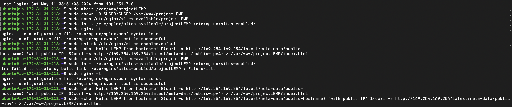
  - Went to browser and open the URL using public ip address of ec2 instance.
    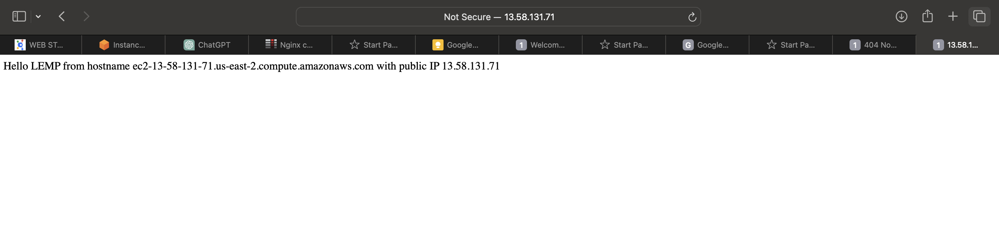

### Conclusion
LEMP stack is now fully configured.

## LEMP-Stack-106 : Testing PHP with Nginx
- Created and opened a new file called info.php within my document root in text editor :
    ```
    nano /var/www/projectLEMP/info.php
    ```
- Added the following line into the new file :
    ```
    <?php
    phpinfo();>
    ```
- Accessed the page in web browser and got following output :
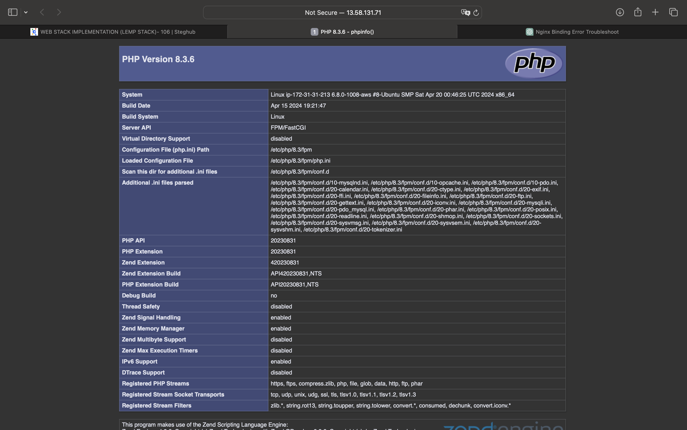

- Used rm to remove that file :
    ```
    sudo rm /var/www/projectaLEMP/info.php
    ```
### Conclusion
Successfully, tested php with nginx.

## LEMP-stack-107 : Retrieving data from MYSQL database with PHP
- Created a test database (DB) with simple "To do list" and configured access to it, so the Nginx website would be able to query data from the DB and display it.
- Connected to the MySql console using root account :
    ```
    sudo mysql-p
    ```
- Created a new database :
    ```
    CREATE DATABASE 'example_database';
    ```
- Created a user and granted full privileges, on the dsatabase just created :
    ```
    CREATE USER 'example_user'@'%' IDENTIFIED WITH mysql_native_password BY 'PassWord.1';
    ```
- Needed to give this user permission over the "example_database" database :
    ```
    GRANT ALL ON example_database.* TO 'example_user'@'%';
    ```
- Closed the mysql shell :
    ```
    exit
    ```
- Logged into MySql console again, using the custom user credentials :
    ```
    mysql -u example_user -p
    ```
- Used example_database :  
    ```
    USE example_database;
    ```
- Created the 'todo_list' table within the 'example_database' :
    ```
    CREATE TABLE todo_list (
    item_id INT AUTO_INCREMENT,
    content VARCHAR(255),
    PRIMARY KEY (item_id)
    );
    ```
- To insert more items into the todo_list table within the example_database database,  used INSERT statements :
    ```
    INSERT INTO example_database.todo_list (content) VALUES ("place todos ");
    ```
- To display all the records in the todo_list table, including the new items we inserted :
    ```
    SELECT * FROM example_database.todo_list;
    ```
    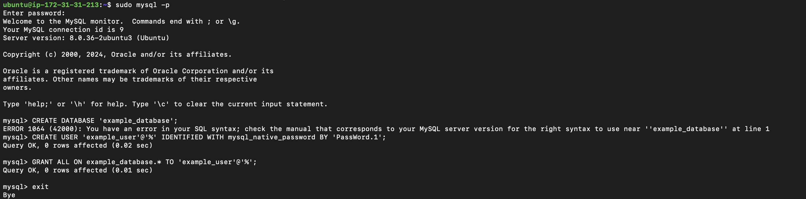
    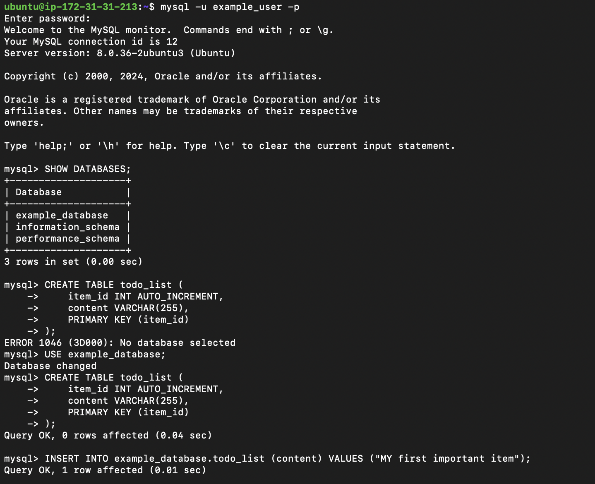
    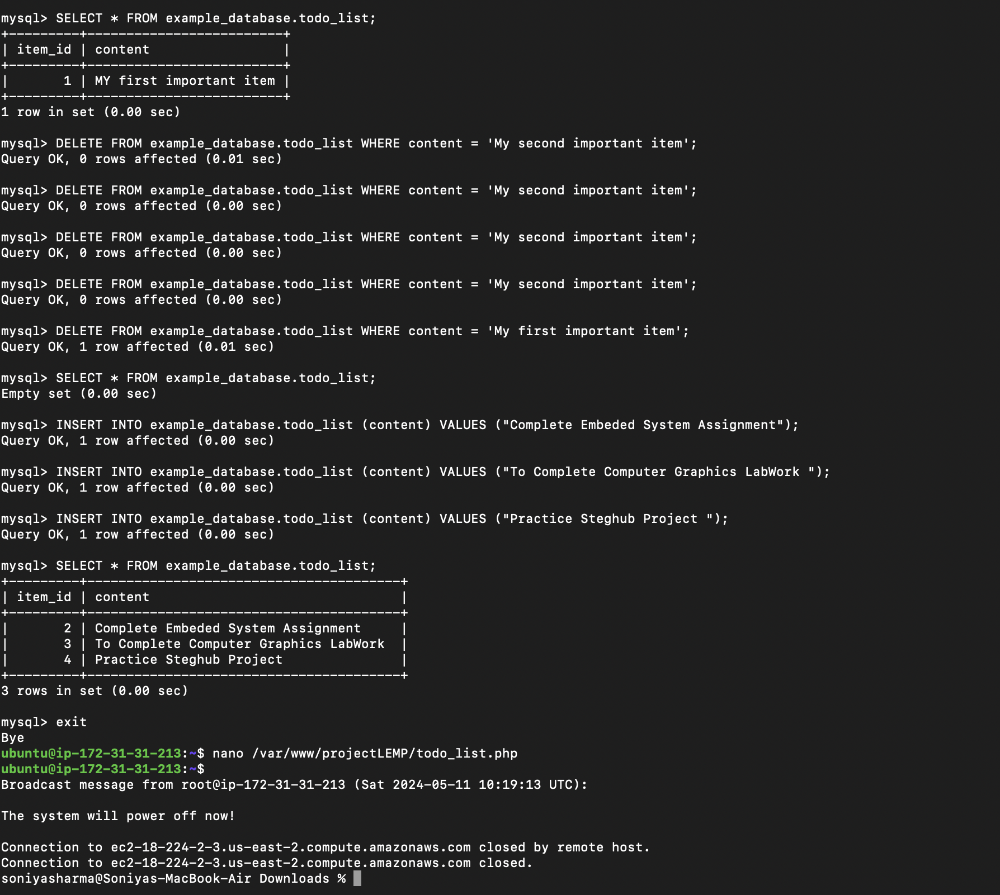

- Created the PHP script that will connect to MYSQL and query for my content. Created a new PHP file in my custom web root directory using nano editor :
    ```
    nano /var/www/projectLEMP/todo_list.php
    ```
- Content as :
    ```
    <?php
    $user = "example_user";
    $password = "PassWord.1";
    $database = "example_database";
    $table = "todo_list";
    try {
        $db = new PDO("mysql:host=localhost;dbname=$database", $user, $password);
        echo "<h2>TODO</h2><ol>";
        // Fetching todo items from the database
        $query = $db->query("SELECT content FROM $table");
        while ($row = $query->fetch(PDO::FETCH_ASSOC)) {
        echo "<li>" . $row['content'] . "</li>";
        }
        echo "</ol>";
    } catch (PDOException $e) {
        // Error handling
        print "Error!: " . $e->getMessage() . "<br/>";
        die();
    }
    ?>
    ```
- Save and Closed the file.
- Accessed this page in my web browser and got :
    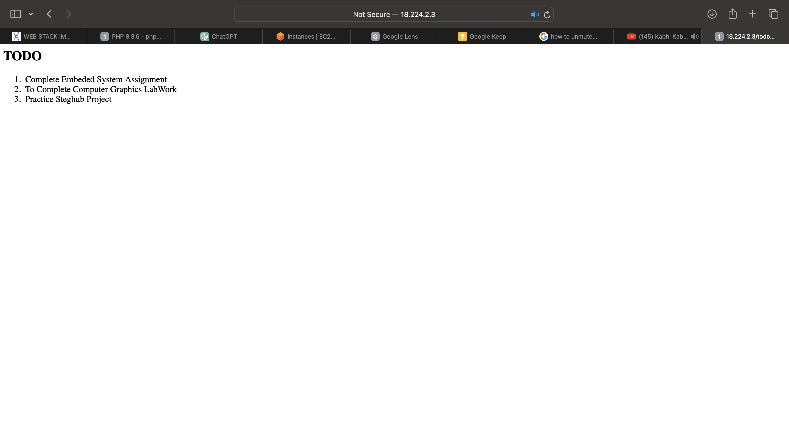

### Conclusion
I had built a flexible foundation for serving PHP websites and applications to my visitors, using Nginx as web server and MySQL as DBMS.


 


