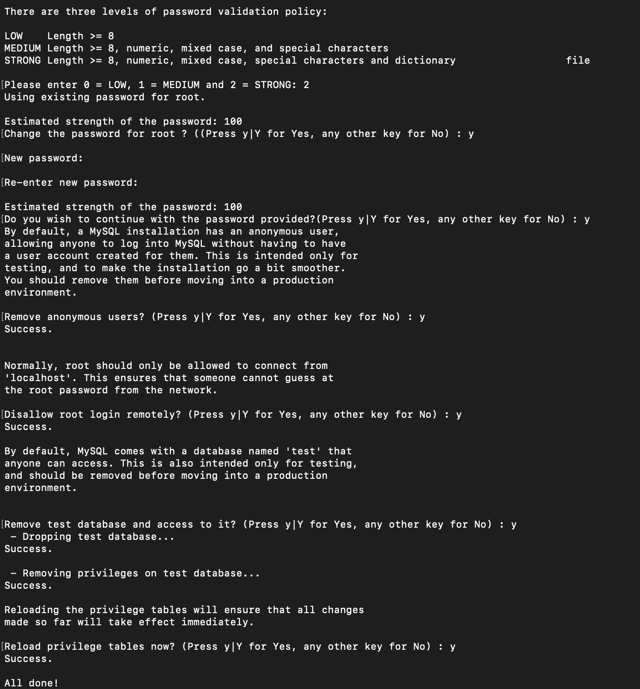

# Documentation on Web-Stack-Implementation-LEMP-STACK-101-107
LEMP refers to a collection of open-source software that is commonly used together to serve web applications. The term LEMP is an acronym that represents the configuration of a Linux operating system with an nginx (pronounced engine-x, hence the E in the acronym) web server, with site data stored in a MySQL database and dynamic content processed by PHP.

## LEMP-Stack-101 : EC2 instace and Virtual Ubuntu Server
AWS acoount was already created in LAMP stack project. I have created another EC2 instance for LEMP Stack Implentation.

### Created New EC2 instance and Setting up 
- First, created an ec2 instance named it as "Second-instance-aws" in a region "Ohio" with instance type "t2.micro", AMI (Amazon Machine Image ) as "ubuntu", previously created security group having inbound rules for (SSH,HTTP,HTTPS) and all other required configuration was selected as default here.
 
 
 
- Latest version of ubuntu was selected which is "Ubuntu Server 22.04 LTS (HVM)". An AMI is a template that contains the software configuration (operating system, application server, and applications) required to launch your instance.
 
- Private key was generated and named it as "Second-private-key" and downloaded ".pem" file.

### Connecting virtual server to EC2 instance
Used the same private key previously downloaded to connect to EC2 instace via ssh:
- Created security group configuration adding ssh and updated this configuration to my ec2 instance to access  TCp port 22.
- Changed the permission for "Second-private-key.pem" file as

  ```
  chmod 400 "Second-private-key.pem"
  ```
- Connected to the instance as
  ```
  ssh -i "Second-private-key.pem" ubuntu@ec2-18-118-196-158.us-east-2.compute.amazonaws.com
  ```
  This get changes as you stopped the ec2 instance and run again.
  

### Conclusion 
Linux Server in the cloud was created.

## LEMP-Stack-102 : Installing the Nginx Web Server
- Nginx (pronounced "engine-x") is an open source reverse proxy server for HTTP, HTTPS, SMTP, POP3, and IMAP protocols, as well as a load balancer, HTTP cache, and a web server (origin server). 
- Nginx was installed using Ubuntu's pacakge manager 'apt'
```
  sudo apt update
  sudo apt install nginx
  ```
  
  

- Verified that nginx is running as a service in ubuntu as
  ```
  sudo systemctl status nginx
  ```
  

### Conclusion 
First WebServer had been launched.

- To recieve any traffic by my webserver, I need to open TCP port 80. Added TCP port 80 in security group inbound rules of my ec2 instance.
Note: TCP port 80 is the default port that web browsers use to access web pages on the internet.

#### We can access Webserver locally and from the internet.
- Checked how I can access it locally, by:
  ```
  curl http://localhost:80
  curl http://127.0.0.1:80
  ```
  

- Finally get access to Nginx Default Page in our web browser that previously got by curl command with nice html formatting by web browser.

  

## LEMP-Stack-103 : Installing MySQL
MySql is a popular relational database management system used within PHP environements.
- Installed MySql by using
  ```
  sudo apt install mysql-server
  ```
  
  

- Set the MySql password 
  ```
   ALTERUSER 'root'@'localhost' IDENTIFIED WITH mysql_native_password BY 'place the password here';
  ```

  

- Did mysql secure installation
  ```
  sudo mysql_secure_installation
  ```
  
  

- Then, Logged into mysql server running
  ```
  sudo mysql -p
  ```
    
- Exited from MySql
  ```
  exit
  ```

### Conclusion
Using all these command, MySQl server was installed and secured.

## LEMP-Stack-104 : Installing PHP
- Installed PHP using command :
  ```
  sudo apt install php-fpm php-mysql
  ```
- Confirming PHP version
  ```
  php -v
  ```
  


